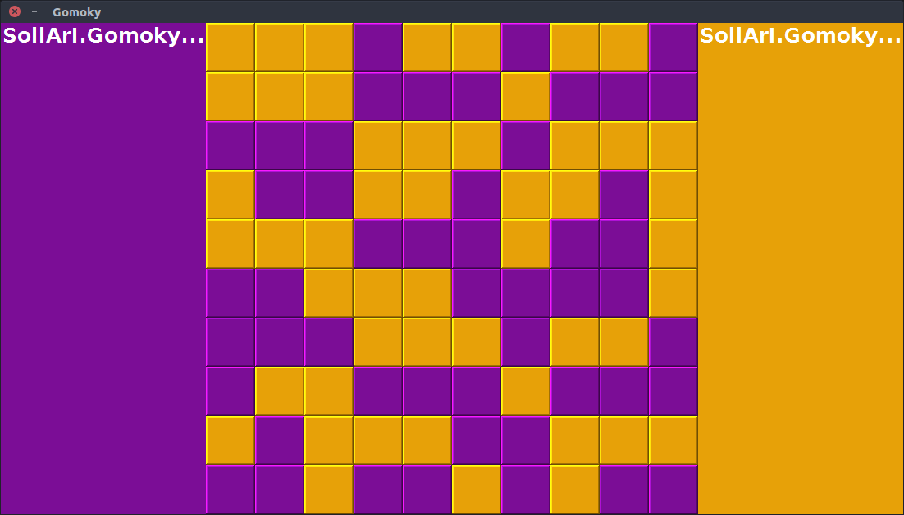

# NaUKMA Java Project 4 Gomoku

Study project at NaUKMA (National University of Kyiv Mohyla Academy) Java course

## Project goal and requirements

The main goal of the project was to create a [Gomoku] game with a possibility
to choose gamers (User or AI).

## Implementation

At the start, dialog window opens. User can choose sides (Player which means 
real person behind the screen) or several variant of AI:

After starting the game, a board appears. The a name of player who is to make
the next turn is colored in red:

Players can make their turns by pressing in the proper place on the screen,
AI maker it's turns automatically:

When someone have 5 in the row, winning cells are highlighted:

User can make AI play agains each other:

Board size can also be changed:

Draw can also happen:

[Gomoku]: https://en.wikipedia.org/wiki/Gomoku
